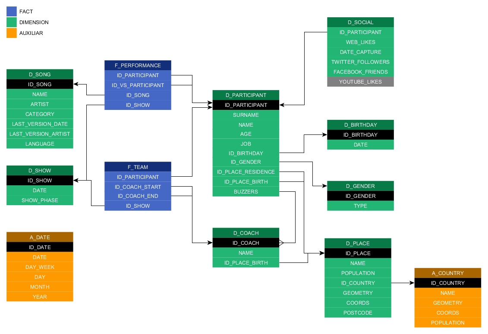
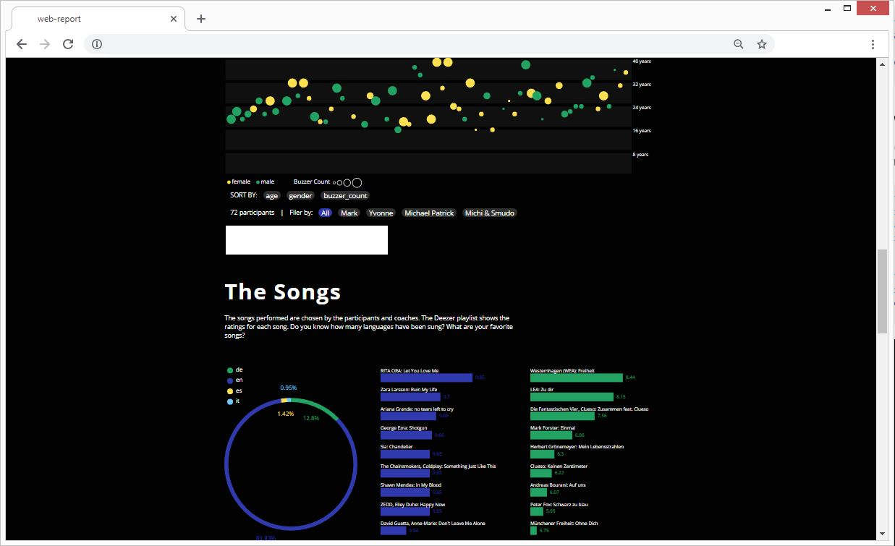
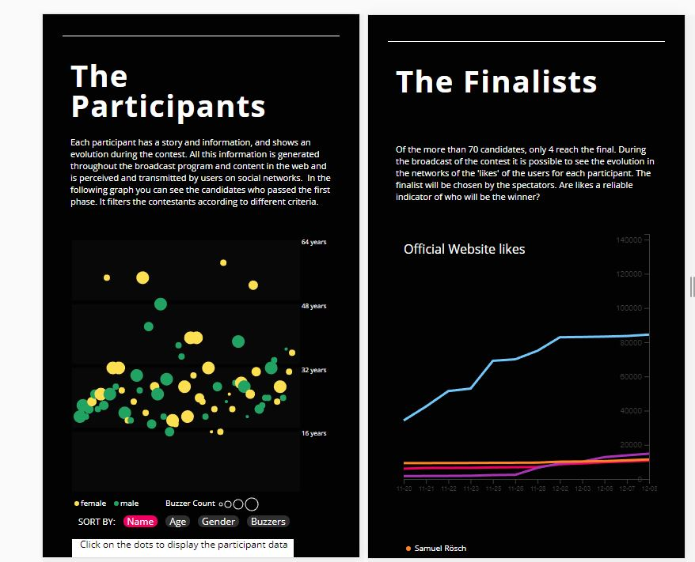
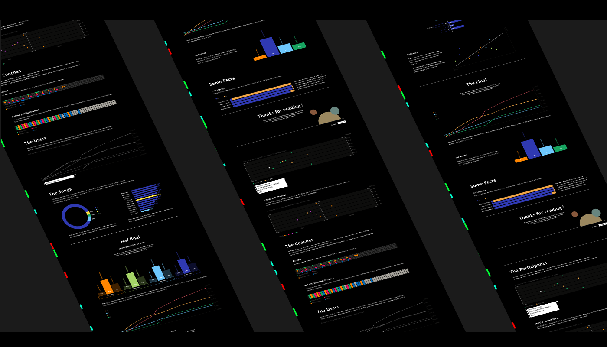

# Voice of Germany 2018 Report

## Abstract
Each year, the 'The Voice' television contest is organized in different countries around the world.
In it, participants compete with their voice and their performances to be chosen and win the final, becoming 'The Voice' of the country.

## Link of the Project
http://motuo.info/tvog18/dist/#/

## Motivation
During the broadcast of the show is growing an interest from the users towards the participants.

Each participant has a story and information:
age, origin, style, etc...
In addition, each participant shows an evolution in the program:
quality,  character, the songs they sing, the performances, their relationship with the coaches and other participants, etc...
All this information is generated throughout the broadcast program and content in the web and is perceived and transmitted by users on social networks.

The rules of the contest allow the initial decision of which participants continue and who does not, of course, reside in the coaches.
Then it is up to the users to decide, through their votes, which participants will continue in the show until the finals.
In this period it is interesting to observe if there are indicators among all the generated data that correspond with the selection results.


## Target
The aim of this project is to analyse the data generated during the broadcasting period of the TV show.

The datasets contains information about candidates, coaches and teams, information about performance and evolution of the social networks.
Using these datasets different analysis and visualization tools will be applied.

This project has no predictive pretension.
The objective is to define a series of analytical questions and implement the necessary tools to answer them.
Specific areas of study are:
- evolution of users in social networks
- correlation of social networks with other factors
- pattern search


## The Project

The project consists of two main blocks. On one part of project consist in the ETL processes and data manipulation, and on the other the visualization part of the processed data.

### Data Processing
The result of part of data processing is a series of scripts that work with different data-sources and libraries.

#### Tools:
  - Selenium ( WebScraping )  
  - Python  
    - json, csv, time, string, itertools, copy, yaml, datetime, re, math
    - numpy, pandas, matplotlib
    - langdetect, langid, guess_language
    - requests

### Data Visualization

The result of the visualization part is a responsive-website in which the data is loaded and displayed dynamically.

#### Tools:
- PHP
- Vue.js
- D3.js


## DataSources

Different data sources have been combined in the project.

The project has been implemented almost in parallel with the broadcasting of the television contest.
This meant that the data sources were non-existent or incomplete.
It has been necessary manual search and process work, but has tried to automate as much as possible the extraction and cleaning of data.

The **sources** used are:

- **Contest Official Website**  
Information about the competitors and the evolution of the teams.  
link: www.the-voice-of-germany.de

- **Dezzer**
List of songs of the TVOG18 contest, with data about users, author infos, album, etc...  
link: www.deezer.com/en/playlist/4933739364

- **songtexte**
List of participants and songs in the blind-auditions by show.  
link:  www.songtexte.com

- **Google**  
Automated extraction of additional information about the songs.  

### Data dimensions


## DataSets
The extracted and processed datasets are located in the 'data' directory of the repository:   
```
[ROOT]/data/
  ./universe
  ./stage
  ./master
 ```

## ETL Tasks

The scripts implemented for the etl processes are located in the 'tasks' directory of the repository:   
```
[ROOT]/tasks/
  ./006_scrapping_all_participants
  ./[...]
  ./lib
 ```

The tasks performed include:

- **Automated periodical data extraction** from the web using Selenium
- **Cleaning and unification of data**: characters, key names, formats, dates, etc...
- **Language recognition** according to song title
- **Automated Search** and extension of data through combination of other sources such as Google
- **Creation of combined datasets** from multiple sources using pandas


## Data Visualization

The code of the website (Server and Client-Side) for the visualization of the data are located in the 'ext' directory of the repository:
```
[ROOT]/ext/web-report-client/
  ./src
  ./dist
  ./package.json
  ./[...]

[ROOT]/ext/web-report-server/
  ./data
  ./reporter.php
 ```

### Development
The website is created with Vue.js and uses the D3.js library for the creation of data visualizations.
The website offers a **responsive design** so it is possible to visualize the data on mobile devices.




### Design
The structure and other necessary elements, such as fonts, colours, etc., were previously designed for the creation of the website.
The complete process can be seen in Behance:  

**Behance: ** https://www.behance.net/gallery/74134533/TVOG18-Report-Tool  


